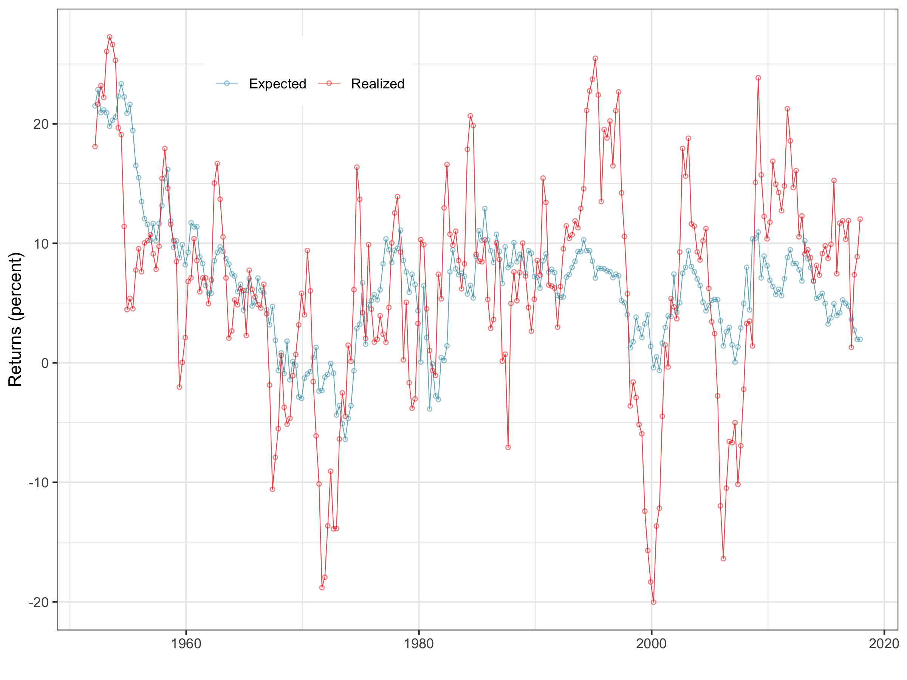

# Measuring the Market Risk Premium

This code updates the measure of equity risk premium.

We use the dividend-price ratio, cay and the three-month T-bill to predict future excess returns

+ *Haddad Valentin, Erik Loualiche, and Matthew Plosser*: **Buyout Activity: the Impact of Aggregate Discount Rates**;  Journal of Finance, February 2017, 72:1
+ [Download the paper](http://loualiche.gitlab.io/www/abstract/LBO.html)
+ [Download the data](https://github.com/eloualiche/RiskPremium/releases)

## Data Sources

1. Measuring Dividend Price ratio uses CRSP Monthly Index files available on [WRDS](https://wrds-web.wharton.upenn.edu/wrds/ds/crsp/stock_a/stkmktix.cfm)
   - `msi.sas7bdat` downloaded from `/wrds/crsp/sasdata/a_stock/msi.sas7bdat`
   - See the calculations to account for reinvested dividends in this [note](./docs/dividendpriceratio.pdf) on how 
2. Measuring the risk-free rate from H15 release available on [FRED](https://fred.stlouisfed.org/series/TB3MS
)
3. Measuring cay from Lettau's [website](http://faculty.haas.berkeley.edu/lettau/data_cay.html). *Last downloaded on May 29 2019*

## Latest estimates 

~~~R
===========================================================
                             Future Excess Returns         
-----------------------------------------------------------
D/P ratio                           2.833***               
                                    (0.419)                
                                                           
cay                                 2.270***               
                                    (0.233)                
                                                           
T-bill (three-month)               -1.152***               
                                    (0.156)                
                                                           
Constant                             0.024*                
                                    (0.013)                
                                                           
Observations                          256                  
R2                                   0.423                 
F Statistic                 61.652*** (df = 3; 252)        
-----------------------------------------------------------
Notes:               ***Significant at the 1 percent level.
                     **Significant at the 5 percent level. 
                     *Significant at the 10 percent level. 
~~~
